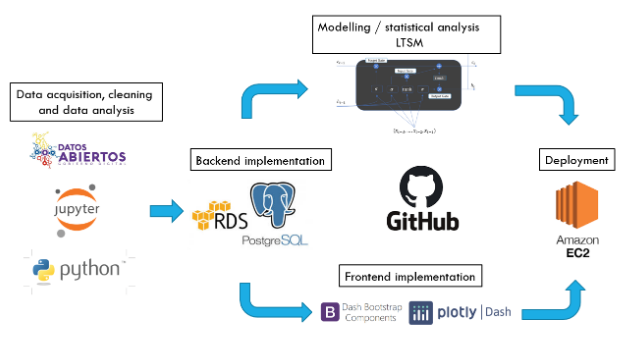
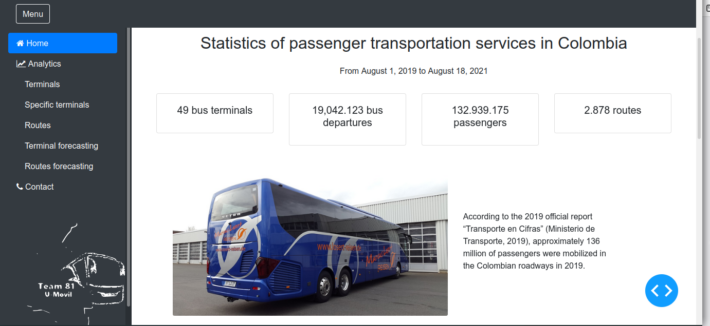
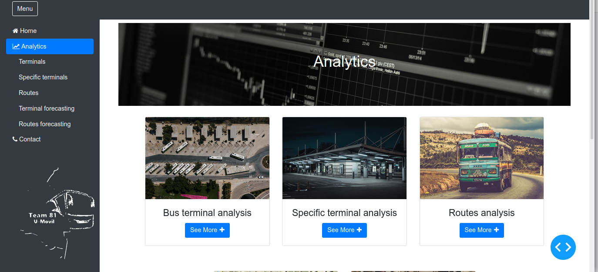
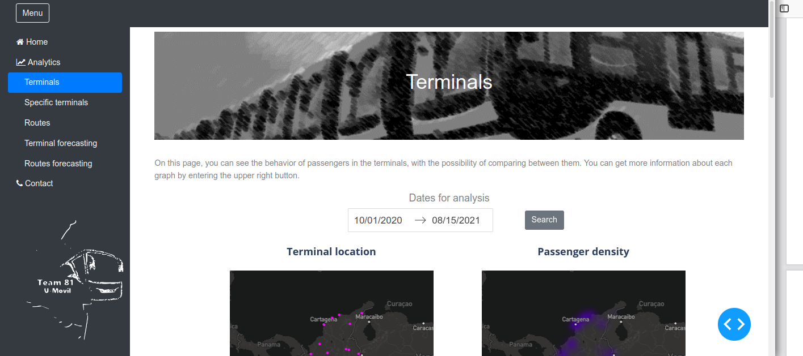
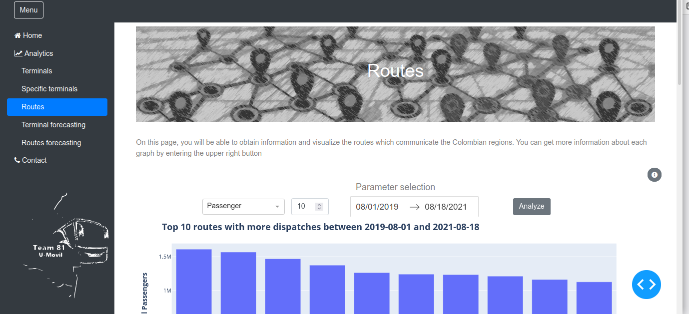
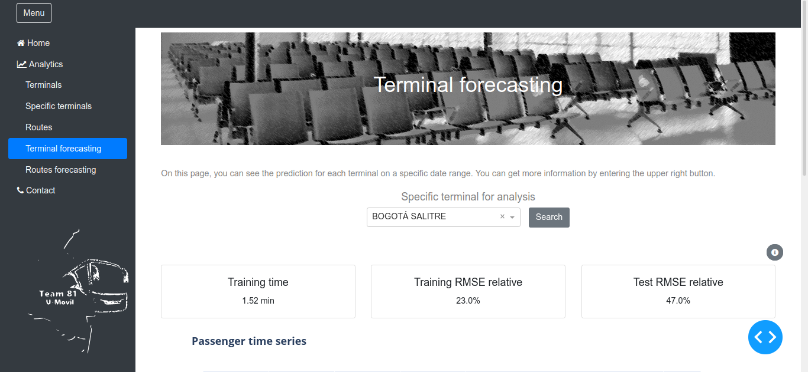
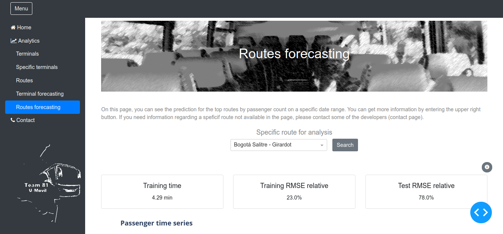

# Team 81 U-Movil 

## About Project

This project seeks to develop a computational approach based on data science 
techniques to forecast passenger demand in different bus terminals and routes 
over Colombia. 

## How project works?

Multiple technologies were used to build the application. To begin with, we obtained the data
from the Colombian open data portal [”Datos Abiertos”](https://www.datos.gov.co/Transporte/Operaci-n-de-pasajeros-y-despacho-de-veh-culos-en-/eh75-8ah6). Then, we explored the data and cleaned
it using the programming language Python with libraries such as pandas, numpy, matplotlib, etc.
We used the IDE Jupyter. After preparing the data we set an RDS AWS database using Postgres
as the database management system. In the following subsection, we detail the database creation
process.


Next we set a Github repository as coding hosting platform and version control. In the repository,
we generated the application interactive plots for analyzing the data using plotly Dash. Also, we
included Dash Bootstrap components for handling the page behavior when showed on different
types of screens (e.g. mobile phones). Simultaneously, in the modeling phase, we developed an
ARIMA model with an LTSM recursive neural network. 



## Installation

This command line install all  python dependences of this project. 

```bash
$ pip3 install -r requeriments.txt
```

## To run app

`index.py` contains main subrutine to run app. The 
following command line run app.

```bash
python3 index.py
```

This app run using **8050 port**

To access to main page, you need access to this link in your browser.

http://localhost:8050 


## files 

This is a basic tree about all files of project. 

```plain
.
├── app.py
├── assets
├── components
├── index.py
├── layout
│   ├── layout.py
│   └── navbar
│       └── navbar.py
│   
├── media
├── pages
│   ├── analitics
│   │   └── analitics.py
│   ├── analysis
│   │   ├── routes
│   │   │   └── routes_analysis.py
│   │   └── terminals
│   │       ├── Datos
│   │       │   ├── Heat-corelation.pkl
│   │       │   ├── heatmap-density.pkl
│   │       │   ├── name-terminals.pkl
│   │       │   ├── pca.pkl
│   │       │   ├── Scatter-plot.pkl
│   │       │   ├── time-series-comparacion.pkl
│   │       │   └── time-series-despachos.pkl
│   │       ├── terminals_analysis.py
│   │       └── terminals_analysis_specific.py
│   │    
│   │       
│   ├── contact
│   │   └── contact.py
│   ├── footer.py
│   ├── home
│   │   └── home.py
│   └── Predicciones
│       ├── Datos
│       │   ├── Modelos rutas
│       │   │   ├── 11001-25307 modelos_rutas.h5
|       |   |   |   ....
│       │   │   ├── 76001-76520 modelos_rutas.h5
│       │   │   ├── dict_modelos_rutas_11_al_20.pkl
│       │   │   └── dict_modelos_rutas_1_al_10.pkl
│       │   └── Modelos terminales
│       │       ├── dict_modelos.pkl
│       │       ├── T.T. DE AGUACHICA modelos.h5
│       │       |   ....
│       │       └── T.T. DE VILLAVICENCIO modelos.h5
│       ├── Predicciones_rutas.py
│       └── Predicciones_terminales.py
├── README.md
├── requirements.txt
└── routes.py
```


## Main pages


### Home
The application is introduced on this page.



### Analytics
On this page you will find the routing to the analysis pages.



### Terminals
On this page you can analyze the behavior of the terminals together




### Routes
On this page you can analyze the behavior of the routes



### Terminal Forecasting
On this page you can view the predictions of the transport terminals.



### Routes Forecasting
On this page you can view the predictions of the routes.




### Contacts
If you want to contact us you can visit this page


## Main Contributors

- Victor González [Github](https://github.com/Vimagoru), [Linkedin](http://www.linkedin.com/in/victor-glz) 
- Jorge Lambraño [Github](https://github.com/jelambrar96), [Linkedin](https://www.linkedin.com/in/jorge-lambra%C3%B1o-a64662157/)
- Andŕes Díaz [Github](https://github.com/andiazo), [Linkedin](https://www.linkedin.com/in/andiazo/)
- Juan Echeverri [Github](https://github.com/Juanda0), [Linkedin](https://www.linkedin.com/in/juan-david-echeverri-villada-533965196)
- Julian Espejo [Github](https://github.com/JulianEspejoD), [Linkedin](https://www.linkedin.com/in/julian-alberto-espejo-diaz-087563129/)
